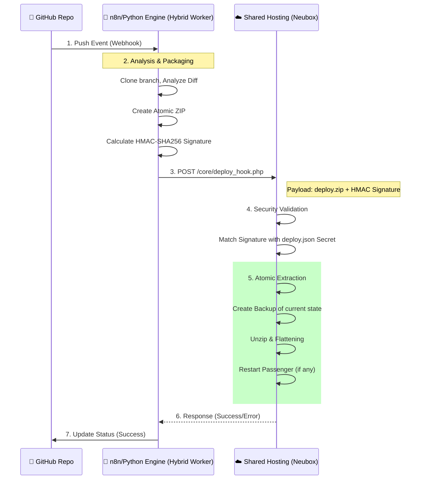

# 🏛️ Architecture: The Automated Deployment Bridge

This document outlines the high-level architecture of **cicd/Agent**, detailing the flows and security mechanisms for atomic deployments.

## 🌉 The Hybrid Worker Concept

Shared hosting restricts us, but doesn't have to stop us. We use a **Hybrid Worker** (Local Mac Studio or similar) to manage the intensive Git tasks and a **PHP Hook** to act as the "Remote Hands" inside the hosting.

---

## 🛰️ Deployment Flow: GitHub to Webhook Engine

---

## 🔒 Security Model: HMAC-SHA256

Unlike traditional FTP that relies on persistent, often plaintext credentials, **cicd/Agent** uses a **signed payload** approach:

1. **Shared Secret**: A high-entropy token is stored in both the Hybrid Worker and on the server (`deploy.json`).
2. **Signature**: For every deployment, the worker calculates a SHA256 Hash of the entire ZIP payload using the secret.
3. **Verification**: The Server re-calculates the hash on arrival. If they don't match, the request is rejected immediately (403 Forbidden).

This prevents:
- **Man-in-the-middle attacks**: The payload cannot be altered.
- **Replay attacks**: A timestamp can be included to limit the valid window (optional).
- **Brute force**: Only requests with the correct signature are processed.

---

## 🔧 Internal File Flattening

GitHub and many CI runners produce a ZIP where all files are nested inside a root folder (e.g., `repo-name-branch-hash/`). 

The **cicd/Agent** engine automatically detects this "Mono-folder" structure and **flattens** the content into the root directory of your hosting, ensuring that `index.php` or `index.html` ends up exactly where it belongs.

---

## 🏆 Rollback Strategy

Before any new deployment is extracted, `deploy_hook.php` creates a full backup (`backup_latest.zip`) of the current state. If a deployment fails or is unstable, a `rollback` action can be triggered to restore previous files in milliseconds.
